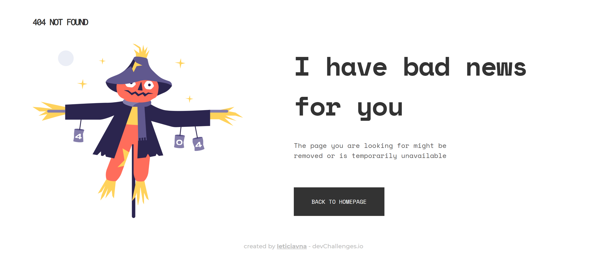

# 404 page

My solution for the [404 page challenge](https://devchallenges.io/challenges/wBunSb7FPrIepJZAg0sY) from [Devchallenges.io](http://devchallenges.io).

- [**Check out the live demo!**](https://dc-rw-notfound.web.app/)

## Table of Contents

- [Overview](#overview)
- [Built With](#built-with)
- [Acknowledgements](#acknowledgements)

## Overview

So, this is the first of the Responsive Web challenges trail. For this trail, I wanted to do it purely using HTML and CSS, without frameworks, to keep practicing the basics, keep it up to date and learn new things.

Although a simple page, I thought it would finish the desktop and mobile versions pretty quickly. While the desktop was fast, I struggled a bit with the image resizing in the mobile version. After some time understanding what would be the best way, I used a media query for the 1086px breakpoint that changed the image width to 65% of the screen. After this change, it seemed to resize much better!

For the deployment of the sites of this responsive web trail, I wanted to take a look at some hosting solutions that I hadn't use before. For this 404 page I deployed it with Firebase hosting. It was a choice more out of curiosity, I wanted to know how Firebase worked so in my opinion it was a great introduction! 

## Built With

- HTML and CSS only!
- Deployed with [Firebase](https://firebase.google.com/docs/hosting)

## Acknowledgements

- [Steps to replicate a design with only HTML and CSS](https://devchallenges-blogs.web.app/how-to-replicate-design/)
- [Top 5 free hosting sites with instructions](https://blogs.devchallenges.io/posts/tJ26U8MhZTPgBSRSwpqr)
